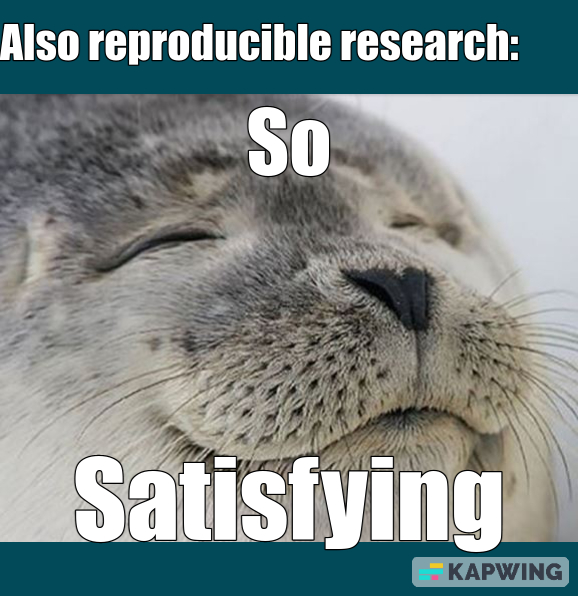

class: middle, center

```{r setup, include=FALSE}
options(htmltools.dir.version = FALSE)
knitr::opts_chunk$set(
  fig.width=9, fig.height=4, fig.retina=3,
  cache = FALSE,
  echo = TRUE,
  message = FALSE, 
  warning = FALSE,
  hiline = TRUE,
  dev = "svglite"
)
repro::automate_load_packages()
links<-yaml::read_yaml(here::here("self-paced-source", "links.yml"))
```

```{r xaringan-themer, include=FALSE, warning=FALSE}
primary_color <- "#024959"
secondary_color <- "#F2D605"
style_duo(
  primary_color = primary_color,
  secondary_color = secondary_color,
  header_font_google = google_font("Didact Gothic", "400", "400i"),
  text_font_google   = google_font("IBM Plex Sans", "400", "400i"),
  text_font_size = "1.5rem",
  )

style_extra_css(css = list(".todo" = list(color = "#17C25B"),
                           ".optional" = list(color = "#05BCE6"),
                           ".large" = list(`font-size` = "130%"),
                           ".small" = list(`font-size` = "80%"),
                           ".tiny" = list(`font-size` = "50%"),
                           ".full" = list(padding = "0px",
                                          margin = "0px",
                                          border = "0px"),
                           ".vertical" = list(`writing-mode` = "vertical-rl",
                                              `text-orientation` = "mixed")),
                )
```

## In a nutshell

.left[

1. aaronpeikert.github.io/repro-workshop/self-paced
2. Do the .todo[green stuff].
3. Take your time.

]


```{r, echo=FALSE}
link <- "aaronpeikert.github.io/repro-workshop/self-paced/"
```

```{r, echo=FALSE, out.width = "30%", out.extra='style="float:center"'}
generate_svg(qr_code(link), here::here("images/", "qr_slides.svg"), foreground = secondary_color, background = primary_color, show = FALSE)
knitr::include_graphics("images/qr_slides.svg")
```

---
class: inverse, center, middle

# Why should we work reproducibly?
---
class: inverse, center, middle

# ~~Why~~ How should we work reproducibly?

---
class: center, middle

# Reproducible Research

# =

# same data + same analysis

# =

# same results

---
class: center, middle

```{r echo=FALSE, out.width= "30%"}
knitr::include_graphics("images/frustrating.gif")
```


.tiny[No idea how to attribute self-made memes.]

---
class: center, middle

```{r echo=FALSE, out.width = "50%"}

```

.tiny[No idea how to attribute self-made memes.]

---
class: middle

.left[

Let me present to you today:

]

.center[

# Reproducible Research: The Bleeding Edge

]

.right[

An action movie.

]


---

## Properties we are after:

* fully automated
* independent of hardware
* independent of users
* continually verified

---

## Problems we want to solve:

1. copy&paste mistakes
2. inconsistent versions of code or data
3. missing or incompatible software
4. complicated or ambiguous procedure for reproduction

---

## Software we will use:

1. R Markdown
2. Git
3. Docker
4. Make

---

## Services we will use:

* Posit Cloud (= RStudio Cloud)
* GitHub (≠ Git)
* GitHub Actions (∈ GitHub)

---
class: middle, center

## TL;DR: This is almost impossible.

## Don't freak out. 
--
Ok, maybe a bit.

---
class: center, middle

# Today:

### I push you to the brink of what is possible†

--

† in the form of a cozy precooked meal.

---

.center[

# Alone in the wild:

]

--

## 1. do the necessary,

--

## 2. than the possible,

--

## 3. and you reach the impossible.

---
class: middle

.center.pull-left[

# Goal for today:

### Understanding what is possible!

]

--

.center.pull-left[

# Not today:

### Reaching a deep technical understanding of what is possible.

]

---
class: inverse, center, middle

.left[Level 1:]

# The necessary

---
class: middle

.center[

.large[code + data]

```{r, echo=FALSE, out.width='30%'}
knitr::include_graphics("https://publicdomainvectors.org/download.php?file=CARTON01.svg")
```

]

---

## A Note on Computing Infrastructure

Usually you work on a private laptop. 
--
**Not today.**

For ease of setup we work in the Cloud. But confusingly we than ask another cloud provider to reproduce everything again somewhere else.

An incomplete list of computational infrastructures:

- laptops
- virtual machines
- single servers
- cloud computers
- high performance computers

---

# Posit / RStudio Cloud

Access the project:

`r links$projekt$start`

---

# A single script

.todo[Look around, become comfortable. Then, locate the files pane.]

--

.todo[Open the R folder.]

.todo[Click on the file `R/prepare_games.R`]

***

.optional[Take a look at `R/prepare_inflation.R` (same thing but more complicated)]

---

# An incomplete list of best practices

1. list requirements early
2. use relative locations
3. document relevant information

---

# A few principles of documentation

.center[

document relevant information = lot of writing

?]

--

## No
--
, not necessarily.

--

1. What is *standard* does not have to be documented.
2. What is *easy* needs only little documentation.
3. What is *consistent* only has to be documented once.

---
class: middle, center

.left[Congratulations, you have completed:]

# Necessary

---
class: inverse, center, middle

# Expanded Goals

---
class: middle

.center[

.large[code + data + text + history + software + workflow]

```{r, echo=FALSE, out.width='30%'}
knitr::include_graphics("https://publicdomainvectors.org/download.php?file=CARTON01.svg")
```

]

---

.center[

# Todo list

]

.pull-left[

## Problems

1. Copy&paste mistakes
2. Inconsistent versions of code or data
3. Missing or incompatible software
4. Complicated or ambiguous procedure for reproduction

]

.pull-right[

## Solutions

1. RMarkdown
2. Git
3. Docker
4. Make

]
---
background-color: #F0F8F8

.center[

```{r, echo=FALSE, out.width='90%'}
knitr::include_graphics("https://raw.githubusercontent.com/aaronpeikert/repro-tutorial/main/images/nutshell.svg")
```

]

---
class: inverse, center, middle

.left[Level 2:]

# Reproducibility: Current practice

---
class: center, middle

.left[Tool to learn:]

# RMarkdown


---
class: inverse, center, middle

.left[Level 3:]

# Reproducibility: best practice

---
class: center, middle

.left[Tool to learn:]

# Git/GitHub

---
class: inverse, center, middle

.left[Level 4:]

# Reproducibility: longterm perspektive

---
class: center, middle

.left[Tool to learn:]

# Docker

---
class: inverse, center, middle

.left[Level 5:]

# Reproducibility: ultimate

---
class: center, middle

.left[Tools to learn:]

# Make + GitHub Actions

---
class: middle

.center[

.large[code + data + text + history + software + workflow]

```{r, echo=FALSE, out.width='30%'}
knitr::include_graphics("https://publicdomainvectors.org/download.php?file=CARTON01.svg")
```

]

---
class: middle, center

<https://github.com/aaronpeikert/repro-workshop/actions>

---
class: middle, center

```{r, echo=FALSE}
knitr::include_graphics("images/qr_slides.svg")
```

[`r link`](https://`r link`)
