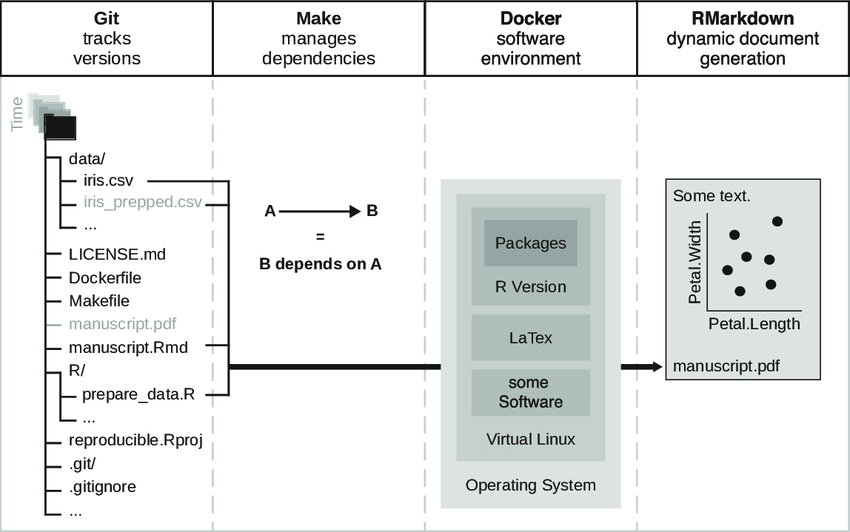

# Dynamic Documents {-}

```{r results='asis', echo = FALSE}
reprodude2 <- generate_reprodudes(links$reprodudes$two,
                                  "ReproDude",
                                  "Hey, I'm your ReproDude for this chapter. If you have any questions click on me and we can talk!")

cat(reprodude2)

```
<div style="clear: both;"></div>

## What do I see before me? {-}
First of all:

<span style="color:green"> Look around, become comfortable. Then, locate the files pane.</span>

You are currently at your computer using Posit Cloud which hosts an R environment that you are looking at.

Do you feel comfortable yet? Yes? Then let's move on. 
If not, take as much time as you need and move on as soon as you want, I have no more Appointments today.

## Best practices? {-}

To give you a sense of how reproducibility can be increased, i will show you some best practices:

<span style="color:green"> Open the R folder.</span>

You should now see three different R files.

<span style="color:green"> Click on the file </span><span style="color:orange">R/prepare_games.R </span>

Now try to understand the code.
Which of these do you already do? 
What could you improve?
You want to see more? 
Because it's you (same thing but more complicated):

<span style="color:green"> Take a look at </span><span style="color:orange">R/prepare_inflation </span>

### A summary? {-}

To summarize this in an incomplete list:

1. List requirements early
2. Use relative locations
3. Document relevant information

Let's talk about the last point. 
Does that mean that every piece of documentation has to be a mile long?

No.... not necessarily.

But how do I decide what should or should not be included in my documentation? 
Let's make another list:

1. What is *standard* does not have to be documented.
2. What is *easy* needs only little documentation.
3. What is *consistent* only has to be documented once.

Great, now you've already finished the necessary! 
You want to go straight on? 
Let's take a look at the extended Goals first.

## Extended Goals? {-}



So, did I confuse you with that?
Don't worry, we're in this together.
What components do we need to get closer to reproducibility?

code + data + text + history + software + workflow

But we have already looked at something. 
Was that already part of the overall picture? 
Yes! 

<span style="color:orange">code + data</span> + text + history + software + workflow

We have already dealt with code and data, so next is text. 
Let's look again at the problems we need to solve:

1. copy&paste mistakes
2. inconsistent versions of code or data
3. missing or incompatible software
4. complicated or ambiguous procedure for reproduction

And the solution software:

1. RMarkdown
2. Git
3. Docker
4. Make

That is, the component text has the problem of copy&paste mistakes and we use RMarkdown to solve the problem.

## RMarkdown {-}

```{r results='asis', echo = FALSE}
addinfo2 <- generate_additionalinfo(links$addinfos$rmarkdown,
                                    "RMarkdown",
                                    "I will give you more information about RMarkdown by taking you to their documentation.")
cat(addinfo2)
```

Now let's go back to your environment.

<span style="color:green">Open the file</span><span style="color:orange">inflation.Rmd.</span>

If you are still in the R folder, you have to go up one level again.

<span style="color:green">Take a minute to skim the document.</span>

Or even two.

<span style="color:green">Click on </span><span style="color:orange">knit.</span>

<span style="color:blue">And if you want to admire more examples, click on </span><span style="color:orange">[RMarkdown Gallery](https://rmarkdown.rstudio.com/gallery.html).</span>

### Metadata (YAML) {-}

Now that you have looked at at least one RMarkdown example, did you notice the following part:

```
---
title: "Inflation Data"
author: "Aaron Peikert"
date: "`r Sys.Date()`"
output: html_document
repro:
  packages:
    - here
    - tidyverse
    - lubridate
    - aaronpeikert/repro@fc7e884
  scripts:
    - R/prepare_inflation.R
  data:
    - data/raw/inflation.rds
---
```

This is the metadata, in YAML format, for the RMarkdown document.

<span style="color:green">Change <span style="color:orange">html_document </span> to <span style="color:orange">pdf_document </span></span>

<span style="color:green">Knit again.</span>

What happened? 
You want to experiment more?

<span style="color:blue">Change the author or date field.</span>
<span style="color:blue">Try the <span style="color:orange">[tufte-format (click me)](https://rstudio.github.io/tufte/).</span></span>

### Text (markdown) {-}

In the document, you probably also noticed this part:

```
The dataset we use stems from the [Bank of England Research datasets](https://www.bankofengland.co.uk/statistics/research-datasets).

I quote:

> This dataset contains the individual responses to our Inflation Attitudes Survey, a quarterly survey of people’s feelings about inflation and other economic variables like the interest rate. 
```

This is markdown and we use it to write and format the actual text.

<span style="color:green">Make something **bold** and something else *italic*:</span>

```
This is **bold**, while this is *italic*.
```

<span style="color:blue">Go to <span style="color:orange">Help → Markdown Quick Reference</span> and try something out.</span>

### Code (R) {-}

But there is another component in the document. 
This part are code blocks like:

```
inflation %>% 
  group_by(date) %>% 
  summarise(across(c(perception, expectation),
                   ~ mean(., na.rm = TRUE)),
            .groups = "drop") %>% 
  pivot_longer(c(expectation, perception)) %>% 
  ungroup() %>% 
  ggplot() +
  geom_line(aes(date, value, color = name)) +
  NULL
```

These code blocks can be not only R code but also Julia, Python, Octave and other programming languages.

<span style="color:green">Add a code chunk (Ctrl + Alt + I) and inline code:</span>

<!-- Bad solution, somethin better? -->
````markdown
A code chunk is for longer code/output:

```{r}
with(mtcars, plot(hp, mpg))
```

Inline code is for single numbers/short text:

We have `r nrow(mtcars)` cars.
````

<span style="color:blue">Include all the code in output with: <span style="color:orange">knitr::opts_chunk$set(echo = TRUE)</span></span>

<span style="color:blue">Try using python:</span>

<!-- Bad solution, somethin better? -->
````markdown
```
print("Hi! Python here, do you miss R already?")
```
````

## And now? {-}

Congratulations, another section done!

Before we continue, let's take a quick look together at what we have just done.
We have now one component more in our toolbox.

<span style="color:orange">code + data + text</span> + history + software + workflow

And with that we solved our first Problem on the list:

1. ~~copy&paste mistakes~~
2. inconsistent versions of code or data
3. missing or incompatible software
4. complicated or ambiguous procedure for reproduction

And which software did we just use for this:

1. <span style="color:orange">RMarkdown</span>
2. Git
3. Docker
4. Make

### Final Step {-}

Now please go through what we have just done and all the software we use. 

You are currently at your computer using Posit Cloud which hosts an R environment where you used RMarkdown to write some examples.

But that was it for this section. 
Shall we both take a short break or do you want to continue straight away?


