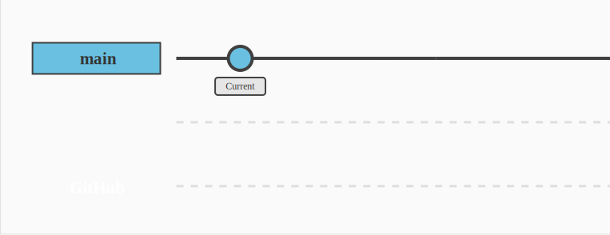
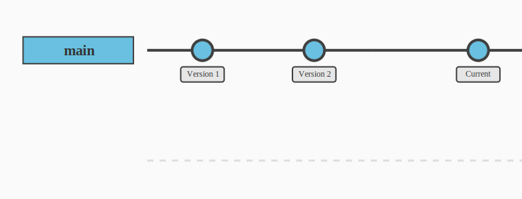

# Version Control {-}

```{r results='asis', echo = FALSE}
reprodude3 <- generate_reprodudes(links$reprodudes$three,
                                  "ReproDude",
                                  "Hey, I'm your ReproDude for this chapter. If you have any questions click on me and we can talk!")

cat(reprodude3)

```

## What now? {-}

Let's get on with it then! 
What's next?

Let's take another look at our components, which ones are we examining now?

code + data + text + <span style="color:orange">history</span> + software + workflow

History? Maybe a look at our problem and software solution list will help to shed some light on the matter.

Problem list:

1. ~~copy&paste mistakes~~
2. <span style="color:orange">inconsistent versions of code or data</span>
3. missing or incompatible software
4. complicated or ambiguous procedure for reproduction

Software solution list:

1. RMarkdown
2. <span style="color:orange">Git</span>
3. Docker
4. Make

So that means we use the Git (and Github) to avoid the problem of inconsistent versions of code and data?

That sounds good, let's get started right away!

## Git? {-}

```{r, echo=FALSE, fig.cap="Git Overview"}
knitr::include_graphics("Git Diagram.svg")
```

Git is an amazing tool that helps you keep track of changes in your project, just like having a magical time machine for your work. 
It's like having a superpower for managing files and projects, especially when you're coding, although it can be used for any type of project that involves files.

Imagine you have a project, and it's like a journey represented by a single line called the 'main' branch.
Each point along this line is a different version of your project, capturing the moments when you've made changes and saved them (committed them). 
It's like preserving snapshots of your progress, allowing you to travel back in time and see how your project evolved.

### Hands on! {-}

```{r results='asis', echo = FALSE}
addinfogit <- generate_additionalinfo(links$addinfos$git,
                                    "Git",
                                    "I will lead you to a cheat sheet for git, how likes remembering?")

cat(addinfogit)
```
<!-- so that there is no text between the Boxes-->
<div style="clear: both;"></div>

Now that we've cleared that up, let's get back to the code.

<span style="color:orange">Modify this code and run it:</span>

```
# use a function without loading the package
# package::function
usethis::use_git_config(
  user.name = "Jane Doe", # <-- change to your name
  user.email = "jane@example.org", # <-- and your email
  init.defaultBranch = "main") # <-- not necessary but kinder than 'master'
```
You will need to do this *once for each computing environment*.

Let us now activate Git.

```
# use a function without loading the package
# package::function
usethis::use_git_config(
  user.name = "Jane Doe",
  user.email = "jane@example.org",
  init.defaultBranch = "main") # <-- not necessary but kinder than 'master'
```
You will need to do this *once per project*.

```{r, echo=FALSE, fig.cap="Your current position"}

```

You have now initialized Git, our time machine, for your project. 
As you can see in figure two, you are on the position called Current and Git has saved Version 1, which has no changes to your current point.
But we can't travel to another time yet, because we are in the first version and there is no history from Git's point of view.

#### Make history {-}

Let's make history then.
To do that we need to change something in the document. 
How about the plot in the code? 
Remember, we are currently in <span style="color:orange">inflation.rmd</span>.

<span style="color:green">The plot is ~~ugly~~ very functional. Beautify it a bit. Some suggestions:</span>

```
  theme_minimal() +
  ylab("subjective inflation in %-points") +
  labs(color = "") +
  theme(legend.position = c(.1, .9)) +
```

<span style="color:blue">Plot the the two or five year expectation.</span>

[Hint: Swapping the variable <span style="color:orange">E1y_all</span> in <span style="color:orange">R/prepare_inflation.R</span> should to the trick.]

Great, now we have changed something!
Can we now just jump back and forth between now and the start, like a time machine should be?

Almost. We need to tell Git beforehand that the current state should become a new point in time. 
In Git, we cannot travel freely in time, but only between time points we set. 

This is exactly the kind of point in time we are setting now through Git commits.

<span style="color:green">Create a commit:</span>
Git pane → Click checkbox of changed files → Commit → Message → Commit
[Note: The Git pane is usually in the same window as the environment variables.]

<span style="color:blue">What can you do when you delete a file by accident?</span>

<span style="color:blue">Can Git help when you loose your computer / access to Posit Cloud?</span>

Now we have performed our first commit! 
What does our Git history look like now?

```{r, echo=FALSE, fig.cap="Your current position"}

```

I see. 
So now we have created a second version that is our modified code and saved it as a point in time. 
And our Current position is identical to version 2 but different from version 1 (we have changed the plot).

But so far everything is only local, if I try to contribute to your code from the other side of the world it won't work, because I don't have direct access to your local git version.

So to provide remote access for you, me, and anyone else you like or at least collaborate with, we use GitHub.

#### GitHub {-}

GitHub is like a virtual space where you can save and share your code with others. 
It makes working with Git easy and accessible, allowing you to collaborate with teammates, track changes, and keep your code safe in one place online.
Let us Introduce our-self to GitHub.

<span style="color:green">To get a GitHub pat/token run:</span>

```
usethis::create_github_token(description = `r texts$general$token`)
```

<span style="color:green">Activate scope <span style="color:orange">write:packages.</span></span>

<span style="color:green">Modify expiration. Today is enough.</span>

<span style="color:green">Copy token.</span>

You will need to do this *once for each computing environment*.


Now we need to store this Token, it is like our Passport for entering the GitHub Country.

<span style="color:green">Set token:</span>

```
gitcreds::gitcreds_set() # <-- Token must *not* go into brackets, paste when asked
```

<span style="color:blue">Verify that everything is in order:</span>

```
usethis::gh_token_help()
```
You will need to do this *once for each computing environment*.

And what have we done now? 

```{r, echo=FALSE, fig.cap="GitHub status"}
knitr::include_graphics("GitGithub0.svg")
```

So far we have only authenticated, so we are allowed to enter GitHub land, but we haven't sent anything there yet.

[Hint: If pushing code fails or asks for the password, we have triggered spam detection. In this case, we will have to repeat the GitHub handshake.]

Now let's use GitHub!

<span style="color:green">To activate GitHub and upload your files to the public web:</span>

```
usethis::use_github()
```

<span style="color:blue">Private alternative/ upload to non-public web (don't use now):</span>

```
usethis::use_github(private = TRUE)
```

<span style="color:blue">Can you simply use code from others that you find on GitHub?</span>

<span style="color:blue">Try <span style="color:orange">usethis::use_mit_license()</span></span>

<span style="color:blue">Up for a challenge? Try <span style="color:orange">usethis::use_readme_rmd()</span></span>

That's it! 
And what does our stand look like now?

```{r, echo=FALSE, fig.cap="GitHub status"}
knitr::include_graphics("GitGithub1.svg")
```

As seen in figure 5, we now have an identical copy of our Git history on GitHub as well!

## And now? {-}

Congratulations, another section done!

Before we continue, let's take a quick look together at what we have just done.
We have now one component more in our toolbox.

<span style="color:orange">code + data + text + history</span> + software + workflow

And with that we solved our second Problem on the list:

1. ~~copy&paste mistakes~~
2. ~~inconsistent versions of code or data~~
3. missing or incompatible software
4. complicated or ambiguous procedure for reproduction

And which software did we just use for this:

1. RMarkdown
2. <span style="color:orange">Git</span>
3. Docker
4. Make

### Final Step! {-}

Now please go through what we have just done and all the software we use. 

You are currently at your computer using Posit Cloud which hosts an R environment where you used Git to create a traceable History with Git and saved it online with GitHub.

But that was it for this section. 
Shall we both take a short break or do you want to continue straight away?

You are now ready for the next chapter. [next chapter](./software-managment.html).
